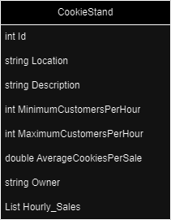

# Cookie Stand Api

The Cookie Stand API is a RESTful web service that allows you to manage and retrieve information about cookie stands in various locations.

This documentation provides an overview of the available endpoints and how to use them.

## API Swagger Documentation URL
[Link](https://localhost:7051/docs/index.html): https://localhost:7051/docs/index.html

### ERD: 

## Endpoints
* Endpoint: POST /cookiestand

Description: Create a new cookie stand with the specified details.

* Endpoint: GET /cookiestands

Description: Retrieve a list of all cookie stands.

* Endpoint: GET /cookiestand/{id}

Description: Retrieve details of a specific cookie stand by its ID.

* Endpoint: PUT /cookiestand/{id}

Description: Update the details of a specific cookie stand by its ID.

* Endpoint: DELETE /cookiestand/{id}

Description: Delete a cookie stand by its ID.
